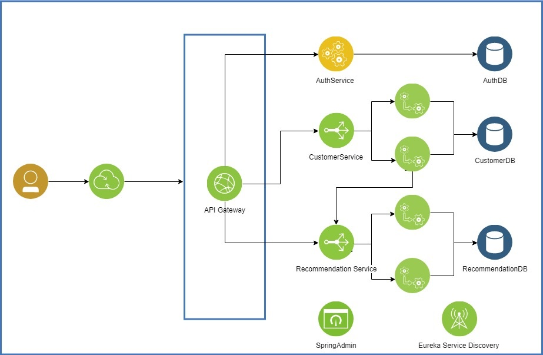

[](https://travis-ci.org/jrsaravanan/KoolCustomer)

# KoolCustomer

A Microservice PoC. 

Build Using
* JDK 8
* Spring Boot
* Spring Admin
* Zuul
* Eureka
* Admin UI
* Cucummber JVM
* Lombok
* Rest Assured
* REST Doc
 
## Architecture


## Build 
```
$ .\mvn.install.sh
$ docker-compose up
```

## Run
```sh

# Build and Run

$ git clone https://github.com/jrsaravanan/KoolCustomer.git

$ cd KoolCustomer

$ .\mvn.install.sh

$ docker-compose up


# Login
$ curl 'http://<YourIP>:9991/v1.0/auth/login' -i -X POST -H 'Content-Type: application/json' -H 'Accept: application/json' -d '{ "username": "appuser", "password": "appuser"}'
HTTP/1.1 200
X-Application-Context: api-service:8080
Date: Sun, 28 Jan 2018 19:27:58 GMT
Content-Type: application/json;charset=UTF-8
Transfer-Encoding: chunked

{"token":"b8ab9902-a250-427c-b1e8-b64d1a888cca","sessionStarted":"2018-01-28T19:25:49.596","activeTime":"2018-01-28T19:27:58.033"}

# Test API , use token as x-auth-token
$ curl 'http://<YourIP>:9991/v1.0/customers/ping' -i -X GET -H 'Content-Type: application/json' -H 'Accept: application/json' -H 'x-auth-token:b8ab9902-a250-427c-b1e8-b64d1a888cca'
HTTP/1.1 200
X-Application-Context: api-service:8080
Date: Sun, 28 Jan 2018 19:57:07 GMT
Content-Type: application/json;charset=UTF-8
Transfer-Encoding: chunked

{"message":"Hello, World!"}


# Add Customer
$ curl 'http://<YourIP>:9991/v1.0/customers' -i -X POST -H 'Content-Type: application/json' -H 'Accept: application/json' -H 'x-auth-token:b8ab9902-a250-427c-b1e8-b64d1a888cca' -d  '{ "firstName":"S2","lastName":"G2","serviceType":"SG","age":100,"emailId":"test@test.com"}'
HTTP/1.1 201
X-Application-Context: api-service:8080
Date: Sun, 28 Jan 2018 20:32:28 GMT
Location: http://<YourIP>:9991/v1.0/customers/3Content-Type: application/json;charset=UTF-8Transfer-Encoding: chunked
{"customerId":3,"firstName":"S2","lastName":"G2","serviceType":"SG","age":100,"emailId":"test@test.com","_links":{"self":{"href":"http://<YourIP>:9991/v1.0/customers/3"}}

# List Customer
$curl 'http://<YourIP>:9991/v1.0/customers' -i -X GET -H 'Content-Type: application/json' -H 'Accept: application/json' -H 'x-auth-token:b8ab9902-a250-427c-b1e8-b64d1a888cca'

```

## Admin Dashboard
http://HostIP:9000

## Discovery 
http://HostIP:8761

## HTTP verbs
Customer Service uses REST standards and adhere HTTP verbs for opearion.


| Verb | Usage |
|------|-------|
| `GET`| Used to retrieve a resource |
| `POST` | Used to create a new resource |
| `PATCH` | Used to update an existing resource, including partial updates |
| `PUT` | Used to update an existing resource, full updates only |
| `DELETE` | Used to delete an existing resource |


## HTTP status codes
The following status codes are used in customer service. As per standard HTTP/REST convention


| Status code           | Usage                                                                                                                     |
|-----------------------|---------------------------------------------------------------------------------------------------------------------------|
| `200 OK`              | Standard response for successful HTTP requests. In a GET request, the response will contain an entity corresponding to the requested resource. In a POST request, the response will contain an entity describing or containing the result of the action. |
| `201 Created`         | The request has been fulfilled and resulted in a new resource being created. |
| `204 No Content`      | The server successfully processed the request, but is not returning any content. |
| `400 Bad Request`     | The server cannot or will not process the request due to something that is perceived to be a client error (e.g., malformed request syntax, invalid request message framing, or deceptive request routing). |
| `404 Not Found`       | The requested resource could not be found but may be available again in the future. Subsequent requests by the client are permissible.|

