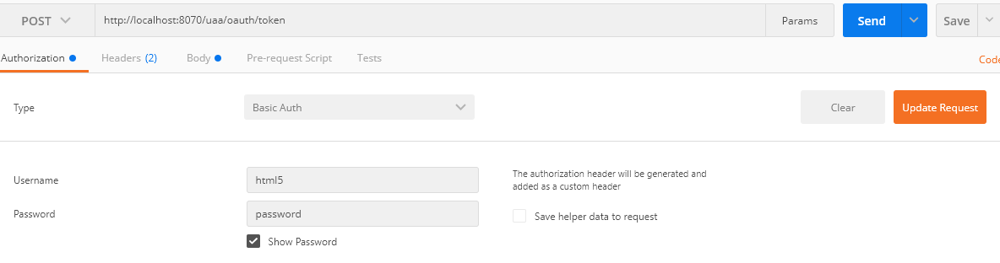
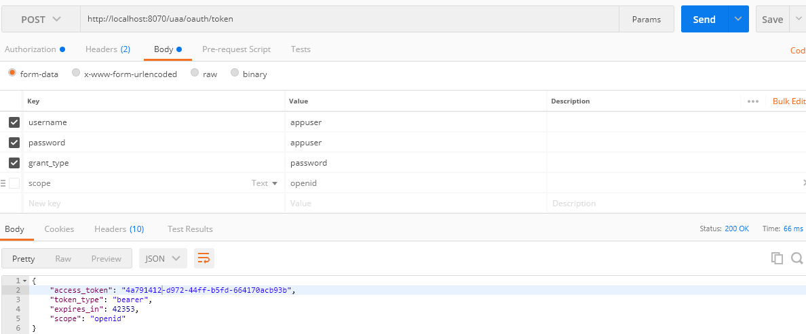

# Customer Auth Service

Customer OAuth2 - Authentication and Authorization Service .


 - Spring Boot
 - Spring Cloud , Eureka
 - Lombok   
 - Spring Admin
 
 ```sh
 # First time to load the data
 # set INIT_DB property to true , default false
 java -jar -DINIT_DB=true customer-auth-0.0.1-SNAPSHOT.jar
 ```
 
### Login






####
```
$ curl -X POST --user "html5:password" -d "grant_type=password&username=appuser&password=appuser" http://localhost:8070/uaa/oauth/token 

```
 
### Validate

```
$ curl 'http://localhost:8070/uaa/user' -H 'Accept: application/json' -H 'Authorization:43507f21-f699-437f-97fa-3ace228827f5'

```

## Run Container in local
```sh

$ mvn dockerfile:build


$ docker run -d --name db -e MYSQL_DATABASE="auth" -e MYSQL_USER="appuser" -e MYSQL_PASSWORD="appuser"  -e MYSQL_ROOT_PASSWORD="root" -p 3306:3306 mysql:5.6

# whenever you span a new container enable  INIT_DB=true
$ docker run  -e PORT=8070 -e INIT_DB=true -e AUTH_APP_USER='appuser' -e AUTH_APP_PASSWORD='appuser'  -e AUTH_DB_URI='db:3306/auth'   -p 8070:8070 --name customer-auth  --link db:db -t jrsaravanan/customer-aut
h

```
